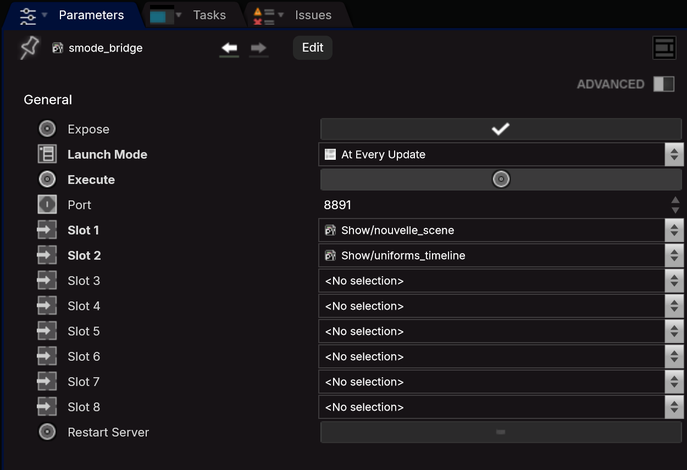
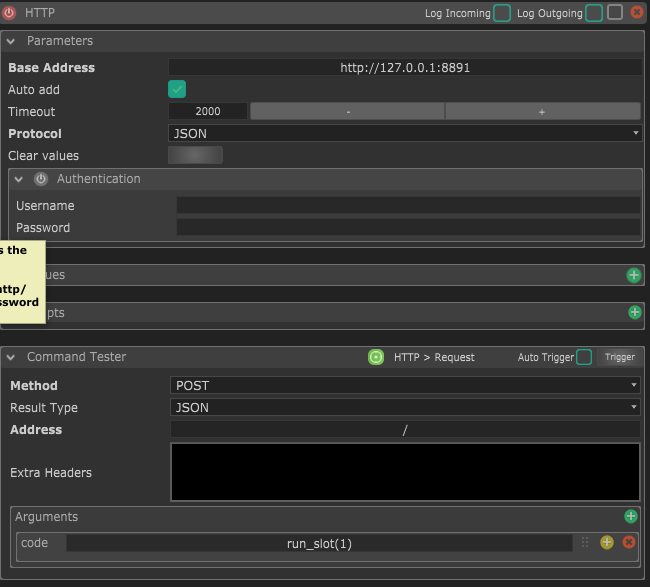

# Controlling Smode Compose with an LLM (MCP) — experimental bridge

*[Version française](README.fr.md)*

A small bridge that lets an AI assistant (Claude, or any client speaking
**MCP** — *Model Context Protocol*, Anthropic's open standard for connecting
an LLM to external tools) manipulate a running Smode Compose session in
natural language, instead of hand-editing code.

Concretely: you describe what you want ("create a camera orbiting a wireframe
cube, with a per-axis speed control"), and the LLM writes and directly
executes the corresponding Python/Oil code inside Smode, observing the
results (and errors) to iterate until it works.

**Important: Smode Tech has not published an official API documentation.**
Everything below comes from on-the-fly introspection (`Oil.docMe()`, `dir()`,
reading example scripts shipped with Smode) and trial and error — not from
guaranteed documentation. This is not an officially supported Smode Tech
tool.

## How it works

Two pieces:

1. **`smode_bridge.py`** — a Python script to paste into a Smode **Script**
   object. It starts a small local HTTP server (`127.0.0.1:8891`) that
   receives Python code and executes it in Smode's Oil/SmodeSDK context (so
   with access to the entire current scene: layers, cameras, animations,
   parameters...).

2. **`smode_mcp_server.py`** — an MCP server (Python, official `mcp` SDK)
   that runs on the assistant side (Claude Code / Claude Desktop, or any
   other MCP-compatible client) and exposes a single tool, `smode_execute`.
   This tool simply relays the code received from the LLM to the HTTP bridge
   inside Smode, and returns the output (`print()`, the value of `result`,
   errors).

```
LLM host  --tool call-->  smode_mcp_server.py  --HTTP POST-->  smode_bridge.py (inside Smode)  --exec()-->  Oil / SmodeSDK
```

### Pitfall encountered: don't execute the received code on the HTTP thread

First version: the HTTP server executed the received Python code directly on
its own thread (the way `execute_blender_code` does in blender-mcp, for
example). Result: **total deadlock**, no request ever got a response
(confirmed via `netstat`, connections stuck in `CLOSE_WAIT` indefinitely).
Executing Oil code apparently has to happen on Smode's main thread, not from
a secondary Python thread.

Solution: the HTTP thread only drops the request into a queue
(`queue.Queue`) and waits on a signal (`threading.Event`). It's the Script
itself, re-run on every update by Smode (Launch Mode = **"At Every
Update"**, NOT `Manual`), that drains the queue and actually executes the
code — always on the main thread, never from the HTTP thread.

## Installation

**Requirements**: Python 3.10+ with the official MCP SDK:
```
pip install mcp
```

**On the Smode side**:
1. Create a **Script** object in a Smode project (any scene/compo works).
2. Paste the contents of `smode_bridge.py` into it.
3. Change its **Launch Mode to "At Every Update"** (mandatory, see above).
4. Compile. The console should print `[smode_bridge] demarre sur
   127.0.0.1:8891`.

**On the LLM client side** (Claude Code, Claude Desktop, or any other
MCP-compatible client such as Cursor, Windsurf, Continue, LM Studio...): add
an entry to the MCP config (`.mcp.json` for Claude Code,
`claude_desktop_config.json` for Claude Desktop, or the equivalent for your
client):

```json
{
  "mcpServers": {
    "smode": {
      "command": "python",
      "args": ["/path/to/smode_mcp_server.py"]
    }
  }
}
```

Restart the client — the `smode_execute` tool should show up.

## Triggering your own Scripts from a button (Stream Deck, Chataigne, any HTTP client)

The bridge isn't only for the LLM: it can also launch Smode Scripts you've
prepared, from anything able to send an HTTP request.

**Slots.** The bridge Script exposes 8 slots (`slot1` … `slot8`). Drag other
Smode Scripts into them (a Script dropped in a slot is automatically forced to
Launch Mode = **Manual**, so it only runs when triggered). Then send a short
payload:

| Payload (`code`)            | Effect                                                     |
|-----------------------------|------------------------------------------------------------|
| `run_script("my_script")`   | Runs the Script named `my_script` found in one of the slots |
| `run_slot(1)`               | Runs the Script sitting in `slot1`                          |
| `list_slots()`              | Returns what each slot contains                             |

The payload can be sent as JSON (`{"code": "run_script('my_script')"}`), as a
form-urlencoded body (`code=run_script("my_script")` — what Chataigne's HTTP
module sends), or as a `?code=` query string, on `POST http://127.0.0.1:8891`.
Example: a Script that creates a ready-to-use Scene, triggered by a Stream
Deck button through Chataigne.

### Smode setup



In the **Parameters** panel of the `smode_bridge` Script:
- **Launch Mode** must stay on **At Every Update**.
- **Port** must match the address entered in Chataigne (8891 by default).
- **Slot 1** to **Slot 8** hold the Scripts to trigger (drag them from Smode's
  browser, or pick them from the menu). Here `nouvelle_scene` is in slot 1 and
  `uniforms_timeline` in slot 2: `run_script("nouvelle_scene")` or `run_slot(1)`
  runs the first, `run_slot(2)` the second.
- **Restart Server**: see below.

### Chataigne setup



1. Add an **HTTP** module and set its **Base Address** to `http://127.0.0.1:8891`
   (the port from the bridge Script's `port` parameter).
2. Create an **HTTP > Request** consequence with **Method** = `POST` and **Address** = `/`.
3. Under **Arguments**, add an argument named `code` whose value is the payload, for
   example `run_script("my_script")` or `run_slot(1)`.
4. Wire that consequence to a condition (for example a Stream Deck button press). The
   **Trigger** button of the *Command Tester* lets you test it without the Stream Deck.

Two ways to designate the Script to run, in the `code` argument:

- `run_slot(1)`: by slot number (first screenshot above). Simple, but you have to update it
  if you reorganize the slots.
- `run_script("nouvelle_scene")`: by Script name (screenshot below). More readable, and
  independent of slot order. This is the recommended method.


**`restartServer` checkbox.** Smode keeps a Script's Python namespace alive
across re-pastes, so after updating `smode_bridge.py` the HTTP server would
keep its *old* request handler, and functions you removed from the code would
stay callable until Smode is restarted. Ticking `restartServer` (it un-ticks
itself) purges the functions no longer present in the source and restarts the
HTTP server with the current handler. Side effect: functions defined on the
fly through `smode_execute` are purged too.

**Pitfalls learned the hard way**
- An uncaught exception in an "At Every Update" Script stops it entirely: the
  bridge then answers `504` to every request. Wrap any per-frame code in
  `try/except`.
- `getUniqueIdentifier()` can't be used from Python (`juce::Uuid` isn't
  convertible) — it raises a `TypeError`.
- A Script in a slot is launched with `tool.execute.trig()` (`execute` is a
  `Trigger` object, not a callable).

## ⚠️ Security — read before use

`smode_execute` runs **arbitrary Python code** received by the HTTP server,
with no authentication. The server only listens on `127.0.0.1` (so it's not
reachable over the network), but **any process running on the same
machine** can send requests to that port while it's running.

- Don't leave this bridge running on a shared or exposed machine.
- This is a tinkering/exploration tool, not something to use as-is in a
  live production/show context without thinking twice.
- If you want a narrower surface, replace `smode_execute(code)` with
  dedicated, restricted MCP tools (e.g. `list_scene()`, `create_layer(type)`,
  `set_parameter(path, value)`) instead of free code execution.

## What we managed to build with it (example)

To validate the bridge, we had the LLM build — through small iterations,
questions/errors/corrections — a wireframe cube with an orbiting camera:
- `GeometryLayer` + `BoxGeometryGenerator` + `ThickLinesGeometryRenderer` for
  the cube
- `AffineCamera` with `TargetOrientationDistance3dPlacement` (native orbit
  around the origin, no manual trigonometry)
- 3 looping `FunctionCue(Angle)` (one per axis), linked to the camera's
  `orientation.x/y/z` via `ParameterLinkTarget`
- A Parameter Bank exposing `Speed X/Y/Z` and a shared `Play/Pause`

All built and debugged by dialoguing with the LLM, with no official
documentation — just introspection (`Oil.docMe()`) and iterating on real
errors.
